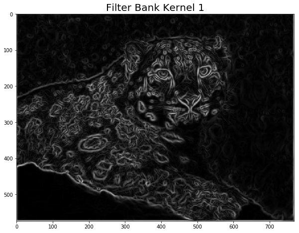
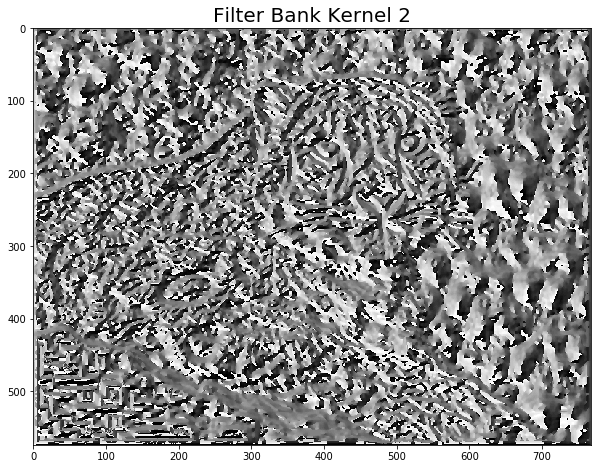
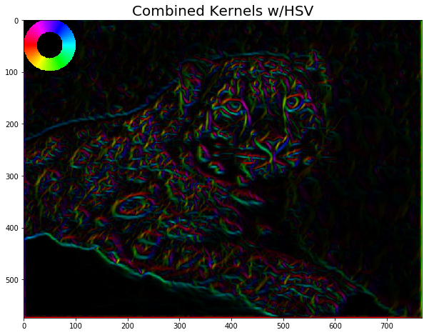

# DSP-Visualization

The following shows examples of ways that python can be utilized to visually display digital signal processing in one dimension (sound)
and two dimensions (images).

## One Dimension 

   Figure shows a generated one dimensional signal
   
.   
.   
.

  Figure shows the FFT of the signal, displaying both the amplitude and phase against frequency

.
.
.

  **Figure shows the inverse fourier transform of the signal**
  .
  .
  .
  

 Figure shows a complex signal; more complex signals will show a more complex 
pattern of amplitudes and phasessignal

Inverse FFT of the signal.
This is how MP3 compression works: components that are 
less relevant (e.g. low amplitude, or low sensitivity to its frequency) 
are removed from the Fourier transform to reduce the total amount of 
data that needs to be saved.
.
.
.
## Two Dimensions

Original Image

Image passed through a filter (and grey scaled)

Image reconstructed using only extracted amplitudes of image

Image reconstructed using only extracted phases of image

Image after fourier analysis. Present are artifacts that are common with jpeg compressed images. This shows how in general compression algorithms work: **higher frequency components are removed.**

Amplitude and frequency can be decorrelated by a process called **whitening**. A uniform amplitude spectrum is applied while retaining the phase spectrum. The image shows how high frequencies dominate the perception, despite all frequencies are equally strong.

The same phenomenon is present in white noise. Such noise has a uniform amplitude spectrum, but perceptually the lower frequencies are not strongly detected.

Original Image

A Gabor filter is applied to display edge effects.
A Gabor filter is a linear filter used for texture analysis, which means that it basically analyzes whether there are any specific frequency content in the image in specific directions in a localized region around the point or region of analysis.

### Filterbank filter

Extracted kernel from filterbank that displays the maximal response strength from the varying orientations

Extracted kernel from filterbank that is used to find out which filter it corresponds to

Combined image using a hue saturation value 

