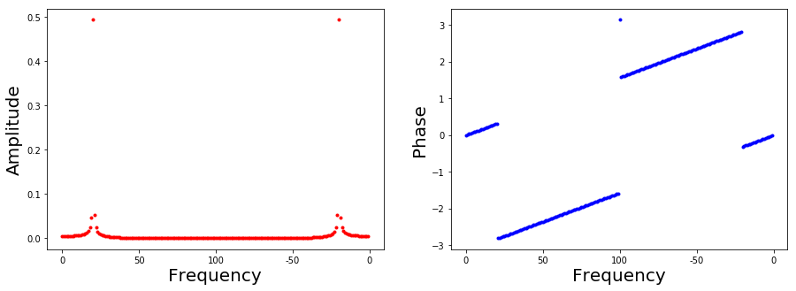
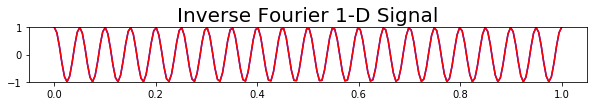
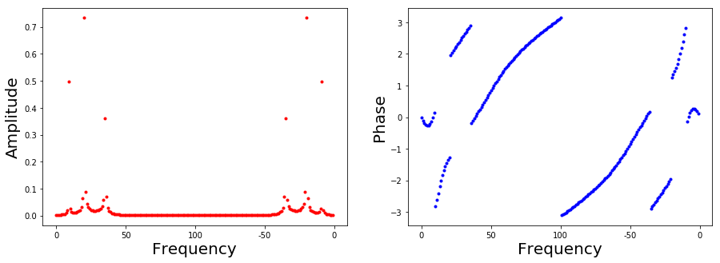
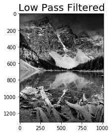
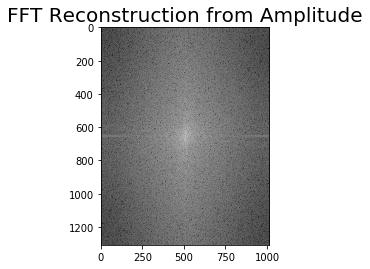
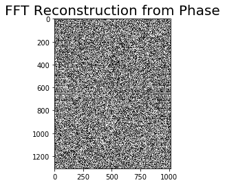
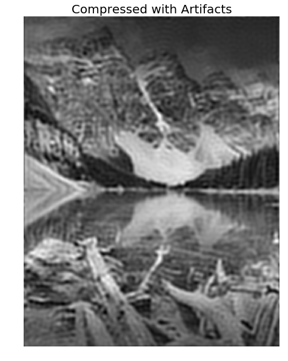
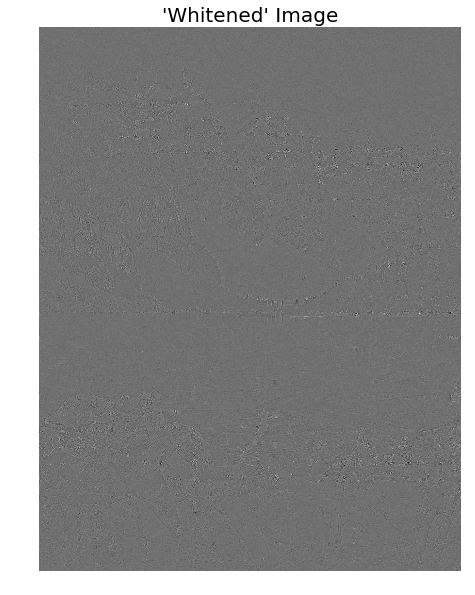
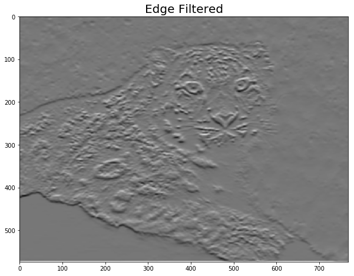

# DSP-Visualization

   **Figure shows a generated one dimensional signal**
   
.   
.   
.

  **Figure shows the FFT of the signal, displaying both the amplitude and phase against frequency**

.
.
.

  **Figure shows the inverse fourier transform of the signal**

