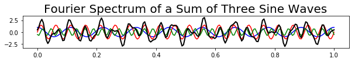

# DSP-Visualization

The following shows examples of ways that python can be utilized to visually display digital signal processing (dsp) in one dimension (sound) and two dimensions (images).

Code uploaded to repository can be run as a small demonstration of python's capabilities in dsp . 
The original images used are uploaded as well for reconstruction purposes

## One Dimension 

#### Background Info:
The **Fourier transform** is a mathematical function that decomposes a waveform, which is a function of time, into the frequencies that make it up. The result produced by the Fourier transform is a complex valued function of frequency. The **Inverse Fourier transform** is used to convert the signal back from the frequency domain to the time domain.
A **Fast Fourier transform** (FFT) is an algorithm that computes the discrete Fourier transform (DFT) of a sequence, or its inverse (IDFT). The FFT's importance derives from the fact that it has made working in the frequency domain equally computationally feasible as working in the temporal or spatial domain. 

   Figure shows a generated one dimensional signal
   

  Figure shows the FFT of the signal, displaying both the amplitude and phase against frequency

  Figure shows the inverse fourier transform of the signal

 Figure shows a complex signal; more complex signals will show a more complex 
pattern of amplitudes and phasessignal

Inverse FFT of the signal.
This is how MP3 compression works: components that are 
less relevant (e.g. low amplitude, or low sensitivity to its frequency) 
are removed from the Fourier transform to reduce the total amount of 
data that needs to be saved.

## Two Dimensions

#### Background Info:

Digital image processing, a subset of digital signal processing, is the use of computer algorithms to perform image processing on digital images.
Taking the fourier-transform a real 2D image (in the mathematical sense of "real", i.e. non-complex values), you will end up with a **magnitude** and a **phase** distribution. The magnitude values tell you something about how much a certain spacial frequency contributes to the image. The phase shows the shifts of the periodic pattern along in the image domain. Hence, the phase is relevant for how the periodic patterns of all wave functions add up and the phase information carries the majority of the spatial information of an image.

Quality of Image is reduced after JPEG **compression** owing to the loss of actual content of the image. JPEG image compression is not suitable for images with sharp edges and lines. A **compression artifact** is a noticeable distortion of media (including images, audio, and video) caused by the application of lossy compression. Lossy data compression involves discarding some of the media's data so that it becomes small enough to be stored within the desired disk space or transmitted (streamed) within the available bandwidth (known as the data rate or bit rate). If the compressor cannot store enough data in the compressed version, the result is a loss of quality, or introduction of artifacts. The compression algorithm may not be intelligent enough to discriminate between distortions of little subjective importance and those objectionable to the user.

**Whitening** or sphering data means that we want to transform it in a way to have a covariance matrix that is the identity matrix (1 in the diagonal and 0 for the other cells; more details on the identity matrix). It is called whitening in reference to white noise.

**Edge detection** includes a variety of mathematical methods that aim at identifying points in a digital image at which the image brightness changes sharply or has discontinuities. The points at which image brightness changes sharply are typically organized into a set of curved line segments termed edges. Edge detection is a fundamental tool in image processing, machine vision and computer vision, particularly in the areas of feature detection and feature extraction.

A **Gabor filter** is a linear filter used for texture analysis, which means that it basically analyzes whether there are any specific frequency content in the image in specific directions in a localized region around the point or region of analysis. Frequency and orientation representations of Gabor filters are claimed by many contemporary vision scientists to be similar to those of the human visual system. They have been found to be particularly appropriate for texture representation and discrimination. In the spatial domain, a 2D Gabor filter is a Gaussian kernel function modulated by a sinusoidal plane wave.

Original Image

Image passed through a filter (and grey scaled)

Image reconstructed using only extracted amplitudes of image

Image reconstructed using only extracted phases of image

Image after fourier analysis. Present are artifacts that are common with jpeg compressed images. This shows how in general compression algorithms work: **higher frequency components are removed.**

Amplitude and frequency can be decorrelated by a process called **whitening**. A uniform amplitude spectrum is applied while retaining the phase spectrum. The image shows how high frequencies dominate the perception, despite all frequencies are equally strong.

The same phenomenon is present in white noise. Such noise has a uniform amplitude spectrum, but perceptually the lower frequencies are not strongly detected.

Original Image

A Gabor filter is applied to display edge effects.

### Filterbank filter

Extracted kernel from filterbank that displays the maximal response strength from the varying orientations

Extracted kernel from filterbank that is used to find out which filter it corresponds to

Combined image using a hue saturation value 

